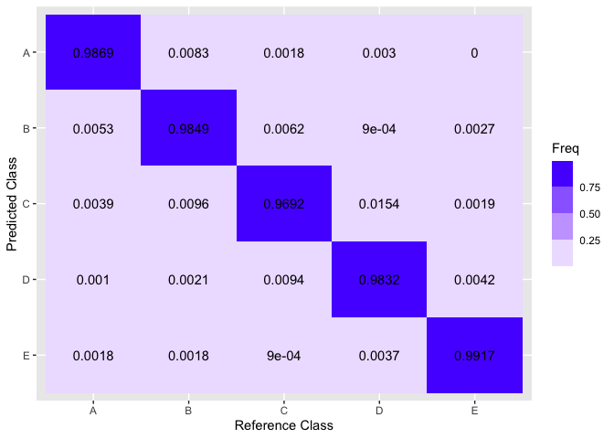

#### Executive Summary

This project is concerned with an array of data (Velloso et al.) related
to on-body motion trackers as they recorded exercise enthusiasts
performing basic dumbbell lifts. A professional trainer was present for
each observation to give a grade to the form of each lift, with an ‘A’
meaning that no form mistakes were made. The intention here is to use
training data to train a machine learning algorithm to recognize, based
on the motion sensor readings, the grade that each observation would
receive. Then, 20 observations for which no grade was given will have
their grades predicted by the chosen algorithm.

The R code used for this analysis utilizes the caret and dplyr packages.

    ## Loading required package: ggplot2

    ## Loading required package: lattice

    ## 
    ## Attaching package: 'dplyr'

    ## The following objects are masked from 'package:stats':
    ## 
    ##     filter, lag

    ## The following objects are masked from 'package:base':
    ## 
    ##     intersect, setdiff, setequal, union

#### Data Acquisition and Preprocessing.

The research that produced the original data came from the observation
of young male subjects performing basic barbell exercises. The aim was
to “define quality of execution” (Velloso et al.) based on on-body
sensor readings.

    # download and store training and testing data
    fileURL<-"https://d396qusza40orc.cloudfront.net/predmachlearn/pml-training.csv"
    download.file(fileURL,destfile="./training.csv",method="curl")
    training<-read.csv('training.csv')
    fileURL<-"https://d396qusza40orc.cloudfront.net/predmachlearn/pml-testing.csv"
    download.file(fileURL,destfile="./testing.csv",method="curl")
    testing<-read.csv('testing.csv')

The training data includes a letter rating from A to E based on quality
of form as observed by a professional trainer for the performance of
that rep. 19,622 observations were recorded for the training set. The
predicting data includes 20 observations featuring all the same data
except for the rating- we will use the code developed here to predict
the quality rating of those 20 observations based only on the sensor
data provided.

    dim(training)

    ## [1] 19622   160

There are 160 columns of data here, but many of them are largely NA. We
preprocess the data frames and remove any columns that have irrelevant
or negligible amounts of data.

    # preprocess data frames
    training$classe<-as.factor(training$classe)
    training_clean<-
    training %>%
    select_if(~ !any(is.na(.)))
    training_clean<-
    training_clean %>%
    select_if(~ !any(is.character(.)))
    training_clean<-training_clean[-(1:4)]

    predicting_clean<-
    testing %>%
    select_if(~ !any(is.na(.)))
    predicting_clean<-
    predicting_clean %>%
    select_if(~ !any(is.character(.)))
    predicting_clean<-predicting_clean[-(1:4)]
    predicting_clean<-predicting_clean[-53]

    dim(training_clean)

    ## [1] 19622    53

    dim(predicting_clean)

    ## [1] 20 52

So, the data frames we are using for training contain 52 possible
predictors and one outcome, which is the factor variable “classe”.

    # show possible predictors
    colnames(training_clean)

    ##  [1] "roll_belt"            "pitch_belt"           "yaw_belt"            
    ##  [4] "total_accel_belt"     "gyros_belt_x"         "gyros_belt_y"        
    ##  [7] "gyros_belt_z"         "accel_belt_x"         "accel_belt_y"        
    ## [10] "accel_belt_z"         "magnet_belt_x"        "magnet_belt_y"       
    ## [13] "magnet_belt_z"        "roll_arm"             "pitch_arm"           
    ## [16] "yaw_arm"              "total_accel_arm"      "gyros_arm_x"         
    ## [19] "gyros_arm_y"          "gyros_arm_z"          "accel_arm_x"         
    ## [22] "accel_arm_y"          "accel_arm_z"          "magnet_arm_x"        
    ## [25] "magnet_arm_y"         "magnet_arm_z"         "roll_dumbbell"       
    ## [28] "pitch_dumbbell"       "yaw_dumbbell"         "total_accel_dumbbell"
    ## [31] "gyros_dumbbell_x"     "gyros_dumbbell_y"     "gyros_dumbbell_z"    
    ## [34] "accel_dumbbell_x"     "accel_dumbbell_y"     "accel_dumbbell_z"    
    ## [37] "magnet_dumbbell_x"    "magnet_dumbbell_y"    "magnet_dumbbell_z"   
    ## [40] "roll_forearm"         "pitch_forearm"        "yaw_forearm"         
    ## [43] "total_accel_forearm"  "gyros_forearm_x"      "gyros_forearm_y"     
    ## [46] "gyros_forearm_z"      "accel_forearm_x"      "accel_forearm_y"     
    ## [49] "accel_forearm_z"      "magnet_forearm_x"     "magnet_forearm_y"    
    ## [52] "magnet_forearm_z"     "classe"

Prepare the data for training (70/30):

    # set random seed for replication
    set.seed(43022)

    # split the training data for testing data
    inTrain<-createDataPartition(training_clean$classe,p=0.7,list=FALSE,times=1)
    train<-training_clean[inTrain,]
    test<-training_clean[-inTrain,]

    # utilize 10-fold cross validation
    cvcontrol <- trainControl(method="cv", number = 10, allowParallel=TRUE, summaryFunction=mnLogLoss,classProbs=TRUE)

### Performance Evaluation: Bagging Algorithm

    # train with bagged decision trees on training_clean dataset
    bag <- train(classe~.,data=train,method="treebag",metric="logLoss",trControl=cvcontrol,importance=TRUE)
    print(bag)

    ## Bagged CART 
    ## 
    ## 13737 samples
    ##    52 predictor
    ##     5 classes: 'A', 'B', 'C', 'D', 'E' 
    ## 
    ## No pre-processing
    ## Resampling: Cross-Validated (10 fold) 
    ## Summary of sample sizes: 12362, 12362, 12363, 12365, 12364, 12361, ... 
    ## Resampling results:
    ## 
    ##   logLoss   
    ##   0.09533941

The logloss score is exceedingly low for this model. Let’s observe its
accuracy on the test partition:

    # evaluate the performance on test data
    bag_testclass <-  predict(bag,newdata=test,type="raw")
    # create confusion matrix and plot with ggplot
    bag_cm<-confusionMatrix(bag_testclass, test$classe, dnn = c("Prediction", "Reference"))
    bag_cm_fr <- as.data.frame(round(bag_cm$table/rowSums(bag_cm$table),4))
    bag_cm_fr$Prediction <- factor(bag_cm_fr$Prediction, levels=rev(levels(bag_cm_fr$Prediction)))

    ggplot(bag_cm_fr, aes(Reference,Prediction, fill= Freq)) +
     geom_tile() + geom_text(aes(label=Freq)) +
     scale_fill_steps(low="white",high="blue") +
     labs(x = "Reference Class",y = "Predicted Class") +
     scale_x_discrete(labels=c("A","B","C","D","E")) +
     scale_y_discrete(labels=rev(c("A","B","C","D","E")))

    # give accuracy and Kappa evaluation metrics
    bag_cm$overall[c(1,2)]

    ##  Accuracy     Kappa 
    ## 0.9836873 0.9793627

The confusion matrix presents a picture of relatively low error rates.
The biggest problem was the misclassification of ’B’s as ’C’s, which
happened 0.96% of the time. The reported accuracy and kappa for the
performance of the model on the test partition is exceedingly high.
Along with the low logloss, this model is most probably appropriate to
use on the prediction data.

### Conclusion: Predict the 20 Mystery Grades

    bag_predictclass<-predict(bag,newdata=predicting_clean,type="raw")
    pred<-data.frame(cbind(as.character(bag_predictclass)))
    colnames(pred)<-c("Predicted Class")
    pred

    ##    Predicted Class
    ## 1                B
    ## 2                A
    ## 3                B
    ## 4                A
    ## 5                A
    ## 6                E
    ## 7                D
    ## 8                B
    ## 9                A
    ## 10               A
    ## 11               B
    ## 12               C
    ## 13               B
    ## 14               A
    ## 15               E
    ## 16               E
    ## 17               A
    ## 18               B
    ## 19               B
    ## 20               B

When these results were used on the final quiz portion of this
assignment, as part of the Johns Hopkins Practical Machine Learning
course on Coursera.com, they were 100% correct.

### Works Cited

Velloso, E.; Bulling, A.; Gellersen, H.; Ugulino, W.; Fuks, H.
Qualitative Activity Recognition of Weight Lifting Exercises.
Proceedings of 4th International Conference in Cooperation with SIGCHI
(Augmented Human ’13) . Stuttgart, Germany: ACM SIGCHI, 2013.
